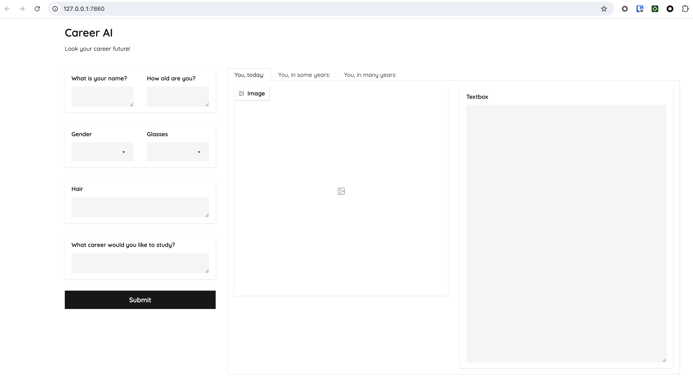
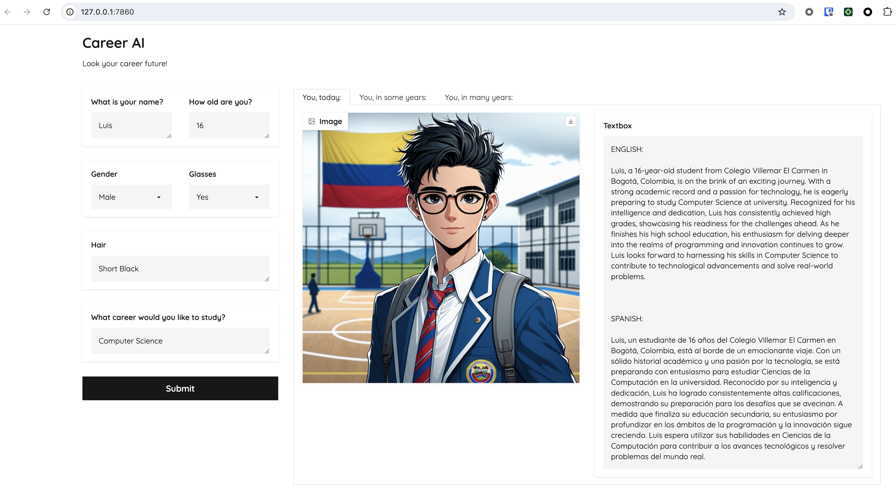
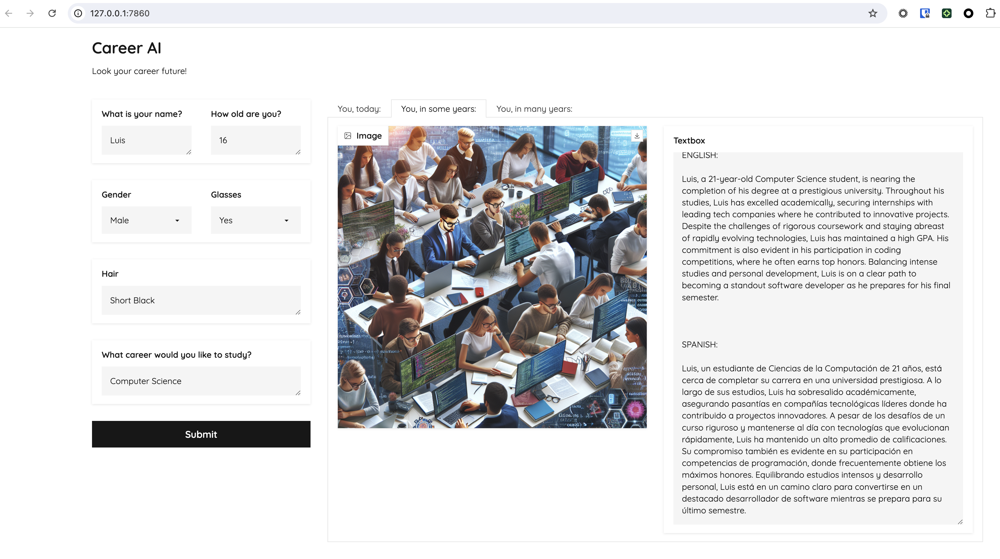
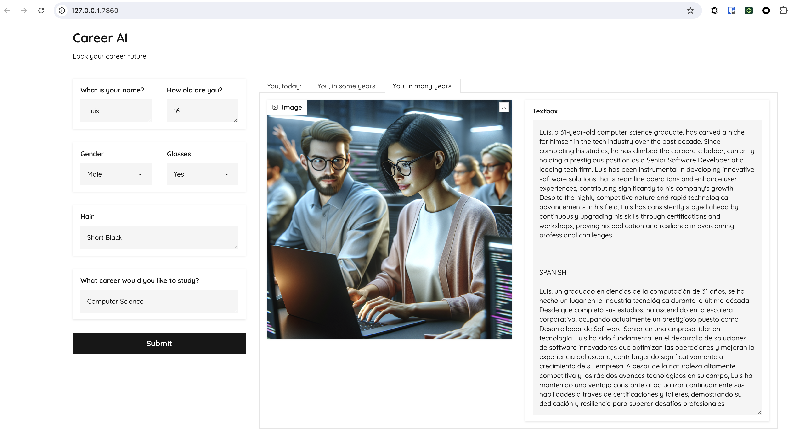

# Career AI

This is an application of Generative AI developed by the Wizeline team for the activities made in Bogotá, Colombia, with the students of San José de Castilla School and Villemar El Carmen School.

The application creates a story about the professional career of the students, based on their interests.

## Technology Stack :computer:

- Python: 3.9.6
- Gradio: 4.19.2
- Openai: 1.35.15
- Pydantic: 2.8.2
- Requests: 2.26.0

## Installation :wrench:

Create a virtual environment

```bash
python3 -m venv venv
```

Activate the virtual environment

```bash
source venv/bin/activate
```

Install the dependencies

```bash
pip install -r requirements.txt
```

Assign the value of the environment variable in the .env file

## Usage :rocket:

Run the application

```bash
python main.py
```

Access the application in your browser: http://localhost:7860/

You will see the following screen:



Fill the fields with the information of the student and click the button "Submit".
The application will generate a story about the professional career of the student of today, in 5 years and in 15 years.







## Demo :tv:

In this link, you can see a demo of the application: [Career AI](https://drive.google.com/file/d/1RuJClFehM0FUOrMpM6oq8HLValp0XKHF/view?usp=drive_link)

Cheers!!